# 浏览器页面渲染原理

## 渲染时间点

当浏览器的网络线程收到 HTML 文档之后，会产生一个渲染任务，并将渲染任务传递给渲染主线程的消息队列。在事件循环机制的作用下，渲染主线程会从消息队列中取出渲染任务并执行任务，开启渲染流程。

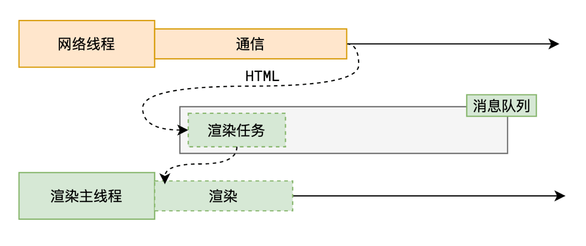

## 渲染流程

整个渲染流程分为多个阶段，分别是：HTML 解析、样式计算、布局、分层、绘制、分块、光栅化、画。每个阶段有明确的输入输出，上一个阶段的输出会成为下一个阶段的输入。

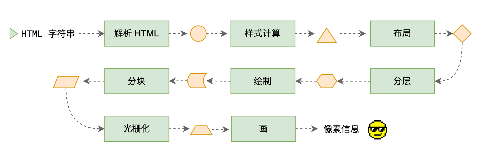

## HTML 解析

解析过程中遇到 CSS 解析 CSS，遇到 JS 执行 JS。为了提高解析效率，浏览器在开始解析前，会启动一个预解析的线程，率先下载 HTML 中的外部 CSS 文件和 外部的 JS 文件。

这一步完成后，会得到 DOM 树和 CSSOM 树，浏览器的默认样式、内部样式、外部样式、行内样式均会包含在 CSSOM 树中。

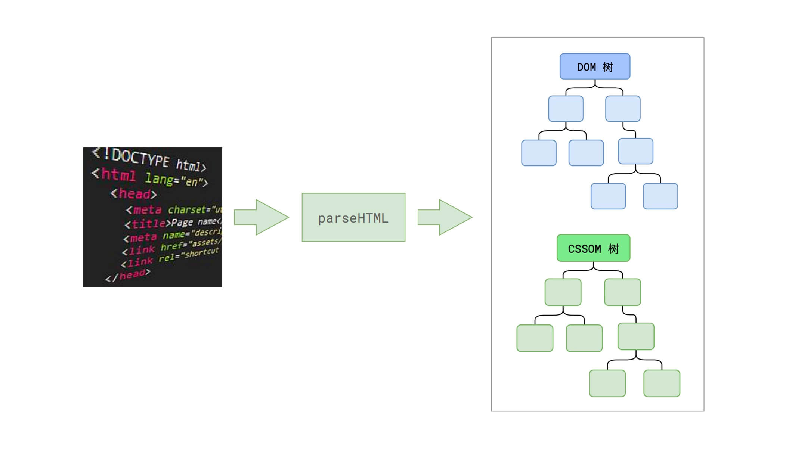

解析出 DOM 树：

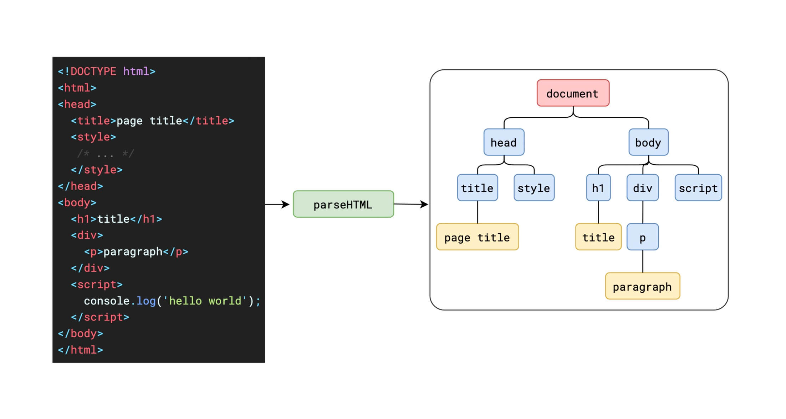

解析出 CSSOM 树：

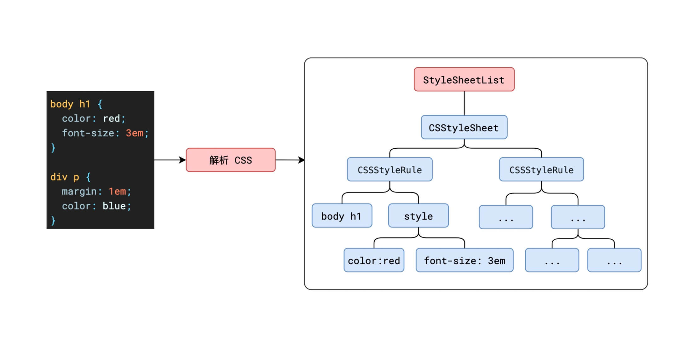

如果主线程解析到 `link` 位置，此时外部的 CSS 文件还没有下载解析好，主线程不会等待，继续解析后续的 HTML。这是因为下载和解析 CSS 的工作是在预解析线程中进行的。这就是 CSS 不会阻塞 HTML 解析的根本原因。

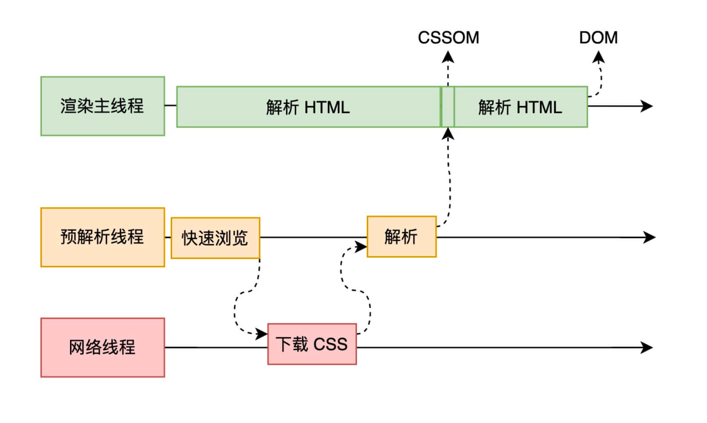

如果主线程解析到 `script` 位置，会停止解析 HTML，转而等待 JS 文件下载好，并将全局代码解析执行完成后，才能继续解析 HTML。这是因为 JS 代码的执行过程可能会修改当前的 DOM 树，所以 DOM 树的生成必须暂停。这就是 JS 会阻塞 HTML 解析的根本原因。

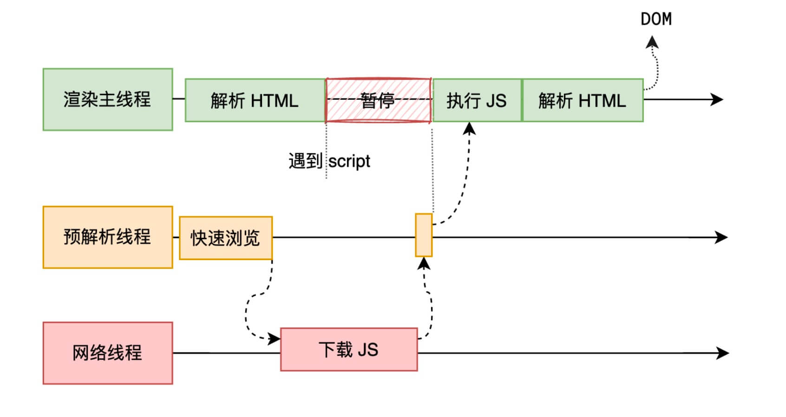

## 样式计算

主线程会遍历得到的 DOM 树，依次为树中的每个节点计算出它最终的样式，称之为 Computed Style。

在这一过程中，很多预设值会变成绝对值，比如 `red` 会变成 `rgb(255,0,0)` ，相对单位会变成绝对单位，比如 `em` 会变成 `px` 。

这一步完成后，会得到一棵带有样式的 DOM 树。

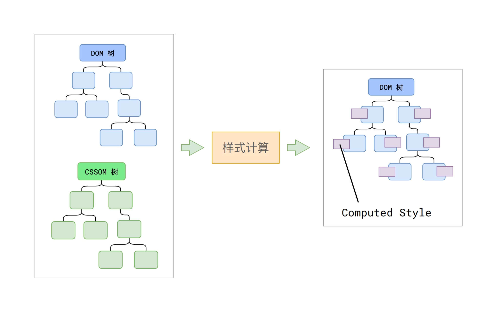

## 布局

接下来是**布局**，布局完成后会得到布局树。

布局阶段会依次遍历 DOM 树的每一个节点，计算每个节点的几何信息。例如节点的宽高、相对包含块的位置。

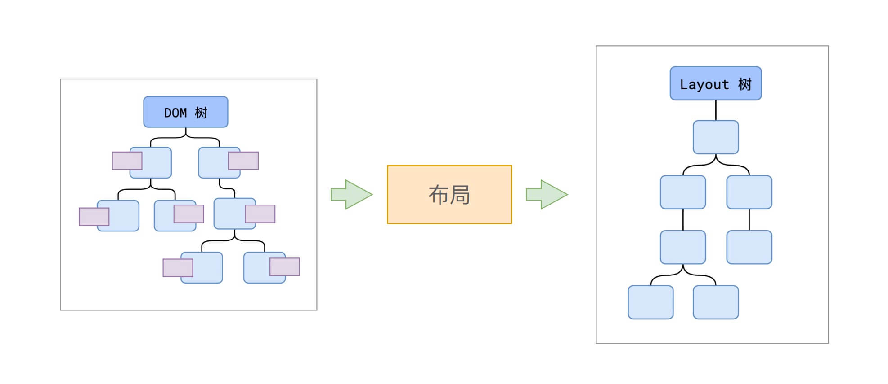

大部分时候，DOM 树和布局树并非一一对应。

比如 `display:none` 的节点没有几何信息，因此不会生成到布局树。又比如使用了伪元素选择器，虽然 DOM 树中不存在这些伪元素节点，但它们拥有几何信息，所以会生成到布局树中。还有匿名行盒、匿名块盒等等都会导致 DOM 树和布局树无法一一对应。

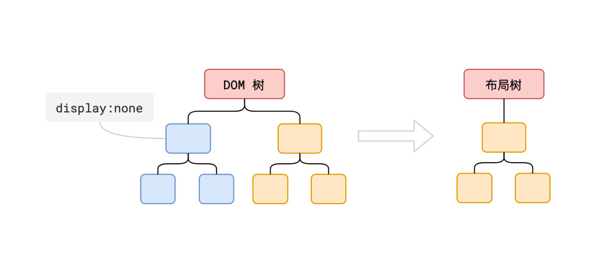

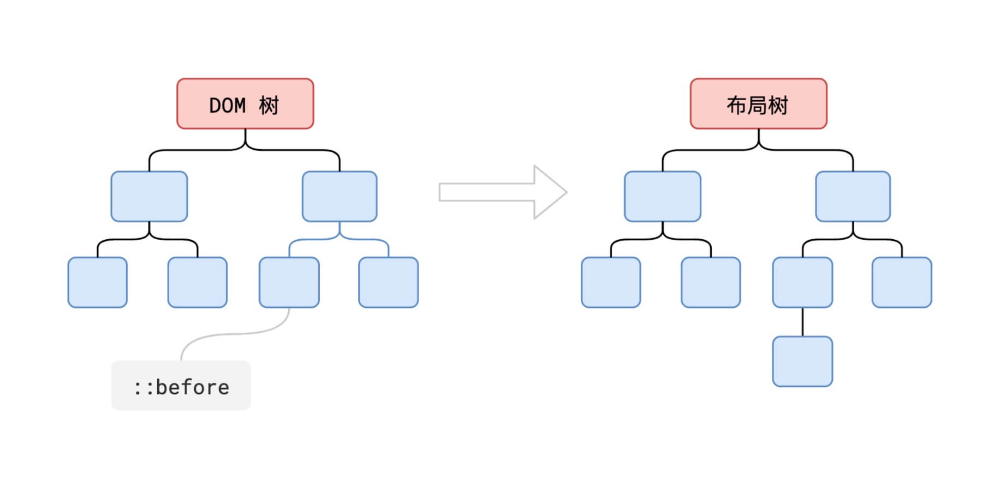

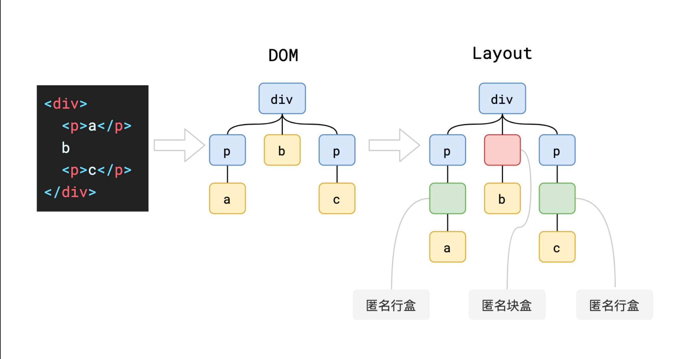

文本内容只能放在行盒中，因此在布局阶段，浏览器会将块盒中的内容放在一个匿名行盒中。

参考：https://developer.mozilla.org/zh-CN/docs/Web/CSS/Visual_formatting_model

## 分层

主线程会使用一套复杂的策略对整个布局树中进行分层。

分层的好处在于，将来某一个层改变后，仅会对该层进行后续处理，从而提升效率。

滚动条、堆叠上下文、transform、opacity 等样式都会或多或少的影响分层结果，也可以通过 `will-change` 属性更大程度的影响分层结果。

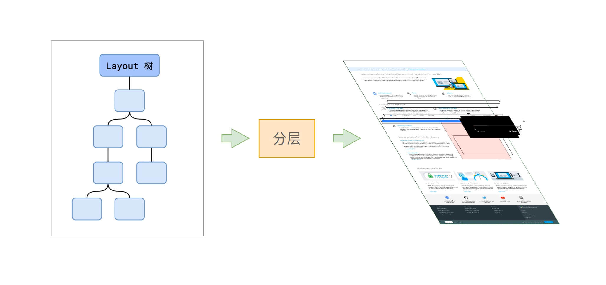

## 绘制

主线程会为每个层单独产生绘制指令集，用于描述这一层的内容该如何画出来。

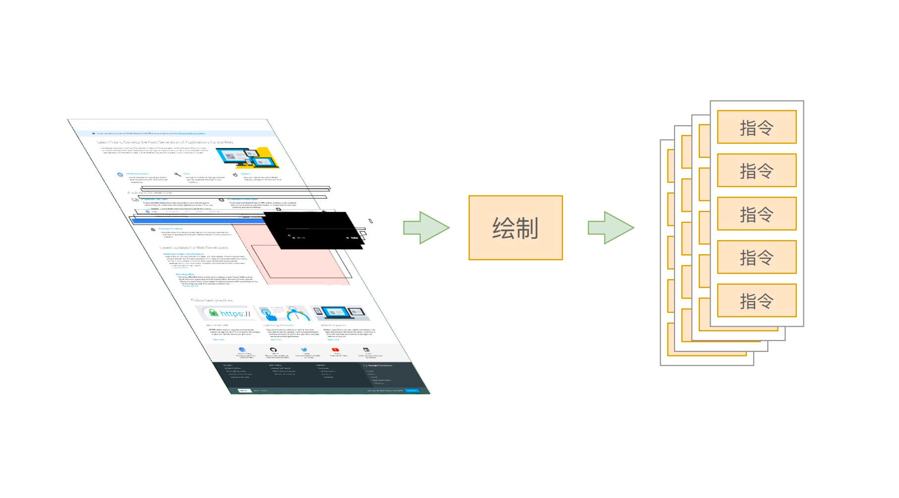

渲染主线程的⼯作到此为⽌，剩余步骤交给其他线程完成。

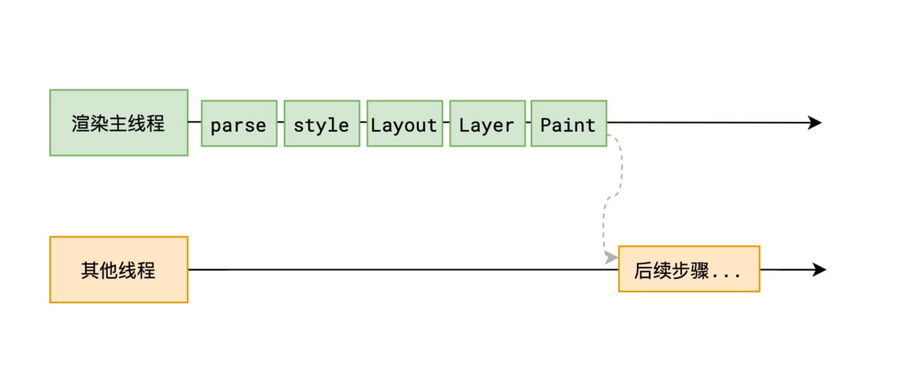

## 分块

完成绘制后，主线程将每个图层的绘制信息提交给合成线程，剩余工作将由合成线程完成。

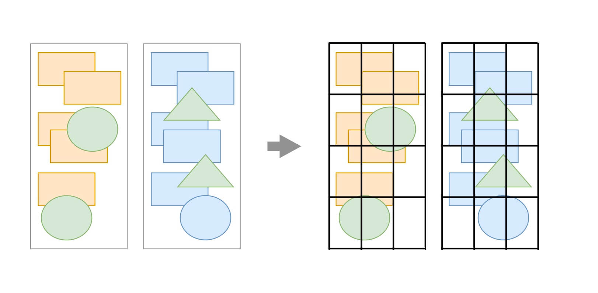

合成线程首先对每个图层进行分块，将其划分为更多的小区域。

它会从线程池中拿取多个线程来完成分块工作。

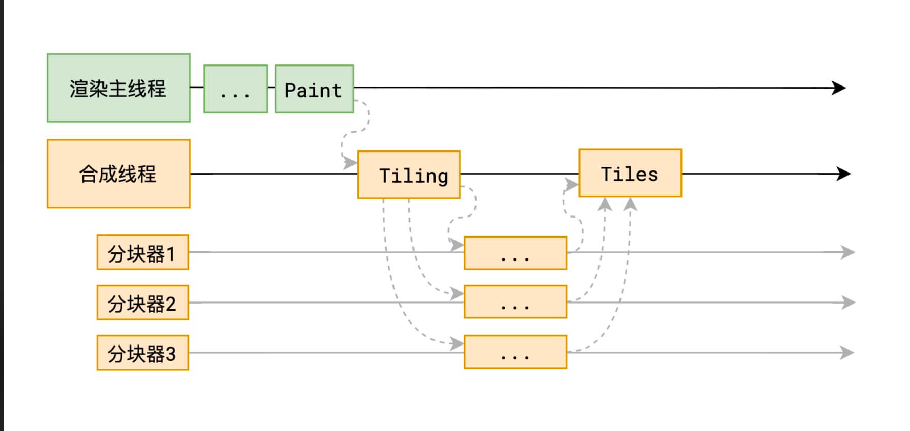

## 光栅化

合成线程会将块信息交给 GPU 进程，以极高的速度完成光栅化。

GPU 进程会开启多个线程来完成光栅化，并且优先处理靠近视口区域的块。

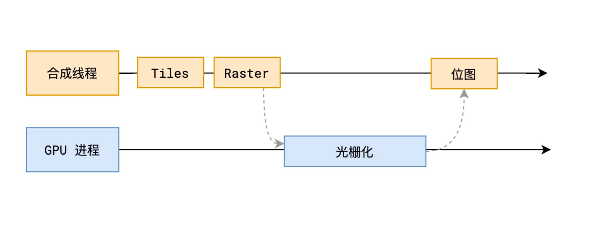

光栅化的结果，就是一块一块的位图。

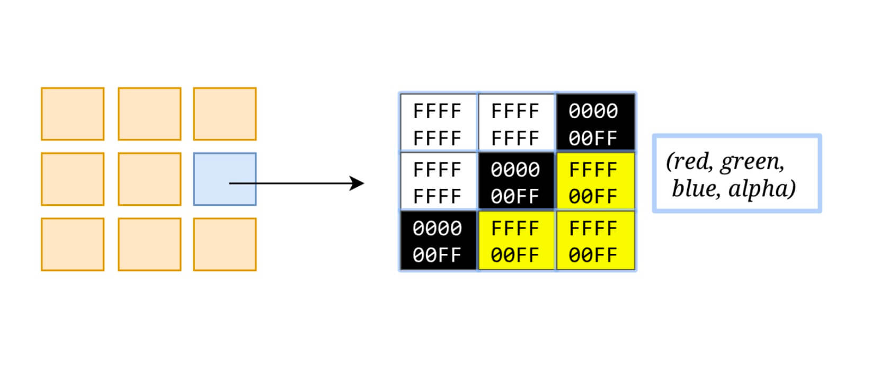

## 画

合成线程拿到每个层、每个块的位图后，生成一个个「指引（quad）」信息。

指引会标识出每个位图应该画到屏幕的哪个位置，以及会考虑到旋转、缩放等变形。

变形发生在合成线程，与渲染主线程无关，这就是`transform`效率高的本质原因。

合成线程会把 quad 提交给 GPU 进程，由 GPU 进程产生系统调用，提交给 GPU 硬件，完成最终的屏幕成像。

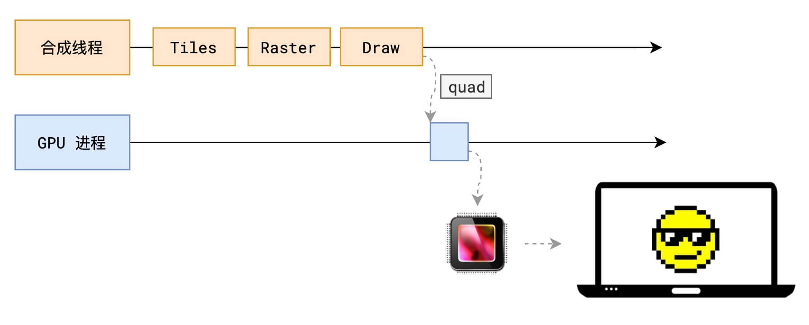

## 完整过程

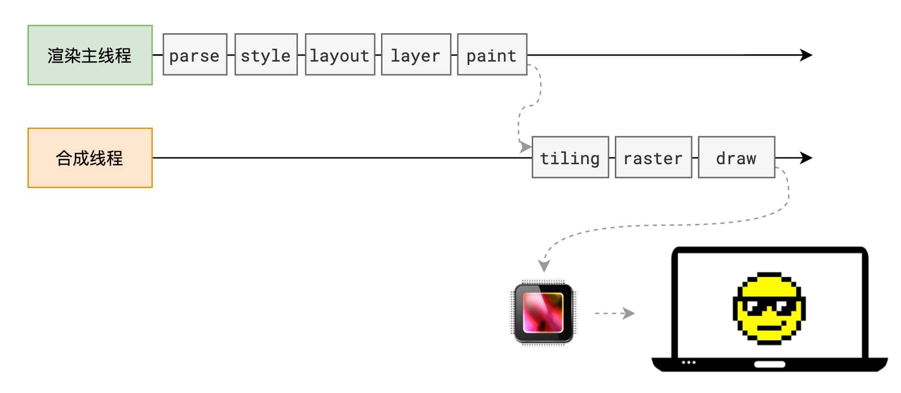

## 什么是 reflow？

reflow 的本质就是重新计算 layout 树。

当进行了会影响布局树的操作后，需要重新计算布局树，会引发 layout。

为了避免连续的多次操作导致布局树反复计算，浏览器会合并这些操作，当 JS 代码全部完成后再进行统一计算。所以，改动属性造成的 reflow 是异步完成的。

也同样因为如此，当 JS 获取布局属性时，就可能造成无法获取到最新的布局信息。

浏览器在反复权衡下，最终决定获取属性立即 reflow。

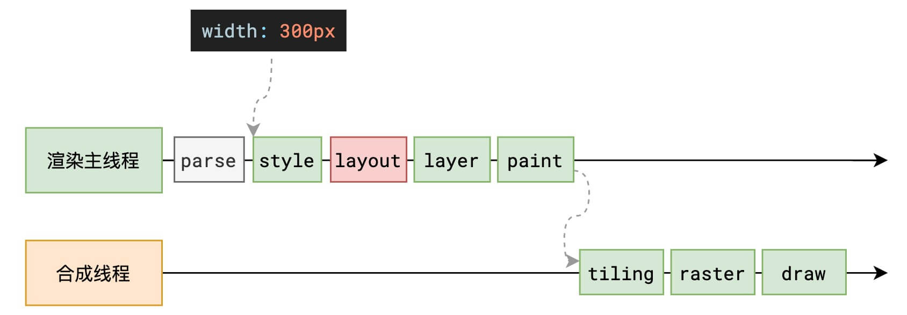

## 什么是 repaint？

repaint 的本质就是重新根据分层信息计算了绘制指令。

当改动了可见样式后，就需要重新计算，会引发 repaint。

由于元素的布局信息也属于可见样式，所以 reflow 一定会引起 repaint。

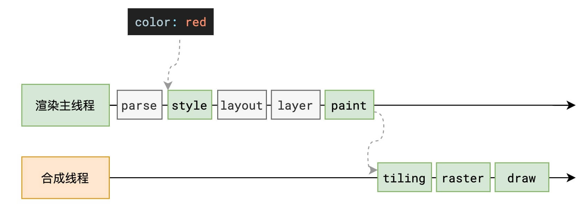

## 为什么 transform 的效率高？

因为 transform 既不会影响布局也不会影响绘制指令，它影响的只是渲染流程的最后一个「draw」阶段。

由于 draw 阶段在合成线程中，所以 transform 的变化几乎不会影响渲染主线程。反之，渲染主线程无论如何忙碌，也不会影响 transform 的变化。

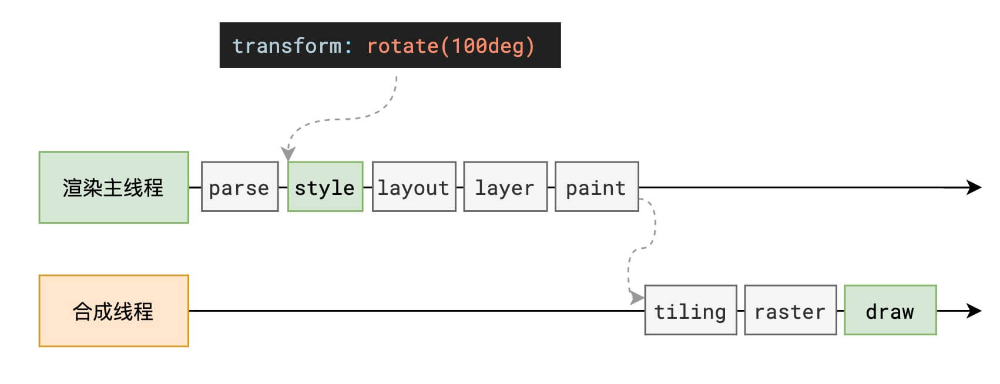

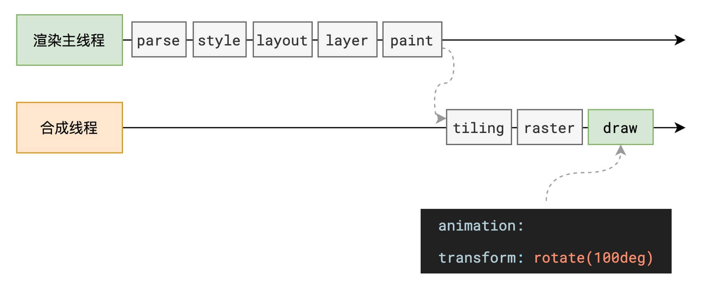
