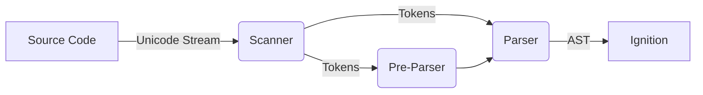
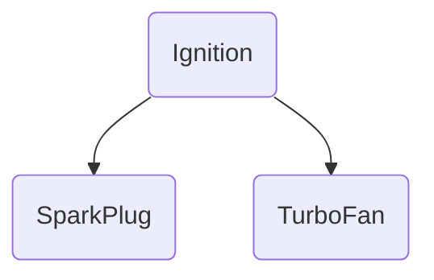
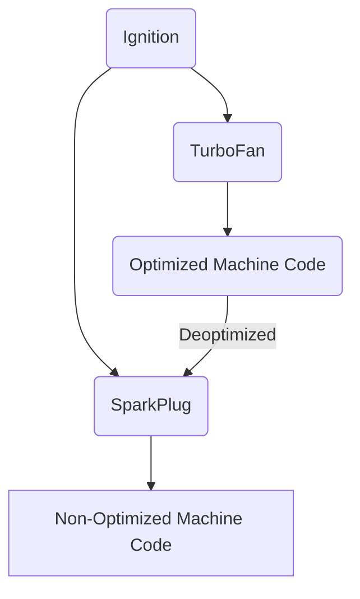

# Chrome V8 引擎简介

V8 是谷歌的开源高性能 JavaScript 和 WebAssembly 引擎，用 C++ 编写。它被用于 Chrome 和 Node.js 等软件。V8 可以独立运行，也可以嵌入到任何
C++ 应用程序中。

## 解析器（Parser）

  <VueMermaidRender :content="`
flowchart LR
    A[Source Code] -->|Unicode Stream| B(Scanner)
    B -->|Tokens| C(Pre-Parser)
    B -->|Tokens| D(Parser)
    C --> D
    D -->|AST| E[Ignition]
`" />

解析器负责将 JavaScript 代码转换成 AST 抽象语法树，解析过程分为两个阶段：

1. 词法分析 (Scanner 词法分析器)
2. 语法分析 (Pre-Parser、Parser 语法分析器)

参考：

1. https://v8.dev/blog/scanner
2. https://v8.dev/blog/preparser

## 解释器（Interpreter）

V8 的解释器是 Ignition，负责将 AST 转换为字节码，执行字节码，并收集 TurboFan 需要的优化编译信息。

参考：

1. https://v8.dev/blog/ignition-interpreter

## 编译器（Compiler）

Sparkplug 是一个转码器/编译器，它将 Ignition 字节码转换为机器码，将 JS 代码从在虚拟机/模拟器中运行转为在本地运行。

Sparkplug 的设计是为了快速编译，以至于我们几乎可以随时进行编译，允许我们比 TurboFan 代码更积极地升级到 Sparkplug 代码。

编译器利用解释器收集到的信息，将字节码转换为优化的机器码。

参考：

1. https://v8.dev/blog/turbofan-jit
2. https://v8.dev/blog/sparkplug
