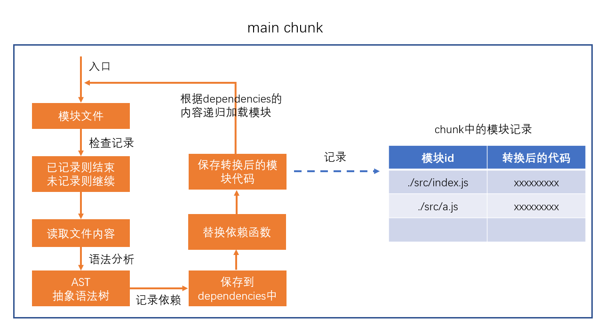
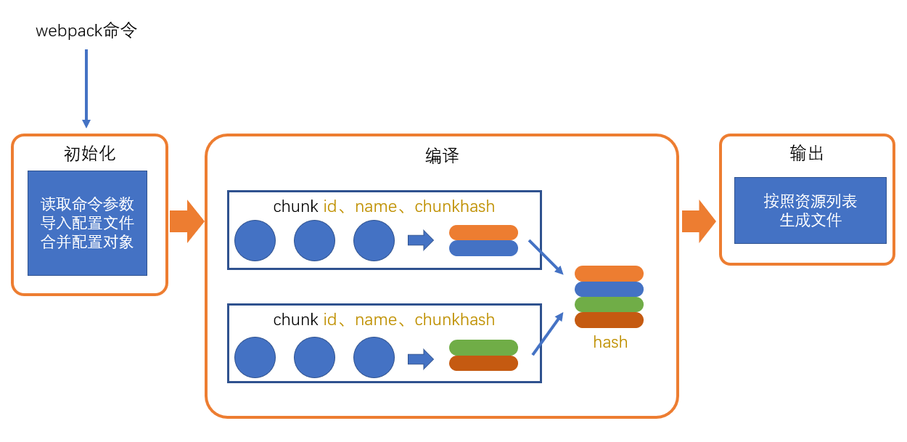

# webpack

webpack 的作用是将源代码编译（构建、打包）成最终代码。

webpack 打包过程可以分为三步：

1. 初始化
2. 编译
3. 输出

## 初始化

初始化时，webpack 会将 CLI 参数、配置文件、默认配置等进行合并，形成最终的配置对象。

## 编译

**1. 创建 chunk**

chunk 是 webpack 内部构建过程中的一个概念，译为`块`，它表示通过某个入口找到的所有依赖的统称。

每个 chunk 都有至少两个属性：

1. name: 默认为 main
2. id: 唯一编号，开发环境和 name 相同，生产环境为从 0 开始的数字

**2. 构建所有依赖模块**

**3. 产生 chunk assets**

在第二步完成后，chunk 中会产生一个模块列表，列表中包含了模块id和模块转换后的代码。

**4. 合并chunk assets**

将多个 chunk 的 assets 合并到一起，并产生一个总的 hash。

## 输出

此步骤非常简单，webpack 将利用 node 中的 fs 模块（文件处理模块），根据编译产生的总的 assets，生成相应的文件。

## 总过程

