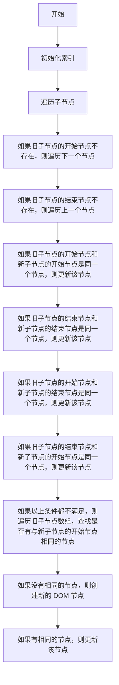

# Vue3 的 Diff 算法

Vue3 的 Diff 算法是基于 Snabbdom 实现的，它的核心思想是同层比较，只比较同一层级的节点，不跨层级比较。这样做的好处是时间复杂度为 O(n)，而不是 O(n^3)。

## 1. patch

patch 函数是 diff 的入口，它接收两个参数 oldVnode 和 vnode，分别是旧的虚拟节点和新的虚拟节点。patch 函数的作用是将 vnode 渲染成真实 DOM，并将其插入到 oldVnode 的父节点中。

```js
function patch(oldVnode, vnode) {
  // 如果 oldVnode 不存在，则创建新的 DOM 节点
  if (!oldVnode)
    return createElm(vnode)

  // 如果 oldVnode 和 vnode 是同一个节点，则更新 DOM 节点
  if (sameVnode(oldVnode, vnode)) {
    patchVnode(oldVnode, vnode)
  }
  else {
    // 如果 oldVnode 和 vnode 不是同一个节点，则将 vnode 渲染成真实 DOM 节点
    const parent = oldVnode.el.parentNode
    const el = createElm(vnode)
    parent.insertBefore(el, oldVnode.el)
    parent.removeChild(oldVnode.el)
  }
}
```

## 2. sameVnode

sameVnode 函数用来判断两个虚拟节点是否是同一个节点，它的判断条件是 key、tag 和 isComment 都相同。

```js
function sameVnode(oldVnode, vnode) {
  return (
    oldVnode.key === vnode.key
    && oldVnode.tag === vnode.tag
    && oldVnode.isComment === vnode.isComment
  )
}
```

## 3. patchVnode

patchVnode 函数用来更新 DOM 节点，它接收两个参数 oldVnode 和 vnode，分别是旧的虚拟节点和新的虚拟节点。patchVnode 函数的作用是将 vnode 渲染成真实 DOM，并将其插入到 oldVnode 的父节点中。

```js
function patchVnode(oldVnode, vnode) {
  // 如果 oldVnode 和 vnode 是同一个节点，则更新 DOM 节点
  if (oldVnode === vnode)
    return

  // 如果 vnode 是文本节点，则更新文本内容
  if (vnode.isComment) {
    vnode.el.textContent = vnode.text
    return
  }

  // 如果 oldVnode 和 vnode 都是静态节点，则直接返回
  if (oldVnode.isStatic && vnode.isStatic)
    return

  // 如果 oldVnode 和 vnode 都存在子节点，则更新子节点
  if (oldVnode.children && vnode.children) {
    updateChildren(oldVnode.el, oldVnode.children, vnode.children)
  }
  else if (vnode.children) {
    // 如果只有 vnode 存在子节点，则添加子节点
    for (let i = 0; i < vnode.children.length; i++) {
      const child = vnode.children[i]
      vnode.el.appendChild(createElm(child))
    }
  }
  else if (oldVnode.children) {
    // 如果只有 oldVnode 存在子节点，则删除子节点
    vnode.el.innerHTML = ''
  }

  // 更新 vnode.el
  vnode.el = oldVnode.el
}
```

## 4. updateChildren

updateChildren 函数用来更新子节点，它接收三个参数 parentElm、oldCh 和 newCh，分别是父节点、旧的子节点数组和新的子节点数组。updateChildren 函数的作用是将 newCh 渲染成真实 DOM，并将其插入到 parentElm 中。

updateChildren 函数的流程如下：



代码实现如下：

```js
function updateChildren(parentElm, oldCh, newCh) {
  // 旧子节点的开始索引
  let oldStartIdx = 0
  // 新子节点的开始索引
  let newStartIdx = 0
  // 旧子节点的结束索引
  let oldEndIdx = oldCh.length - 1
  // 新子节点的结束索引
  let newEndIdx = newCh.length - 1
  // 旧子节点的开始节点
  let oldStartVnode = oldCh[0]
  // 旧子节点的结束节点
  let oldEndVnode = oldCh[oldEndIdx]
  // 新子节点的开始节点
  let newStartVnode = newCh[0]
  // 新子节点的结束节点
  let newEndVnode = newCh[newEndIdx]

  // 根据 key 创建映射表
  const oldKeyToIdx = createKeyToOldIdx(oldCh, oldStartIdx, oldEndIdx)
  // 遍历新子节点数组
  while (newStartIdx <= newEndIdx && oldStartIdx <= oldEndIdx) {
    // 如果旧子节点的开始节点不存在，则遍历下一个节点
    if (!oldStartVnode) {
      oldStartVnode = oldCh[++oldStartIdx]
    }
    // 如果旧子节点的结束节点不存在，则遍历上一个节点
    else if (!oldEndVnode) {
      oldEndVnode = oldCh[--oldEndIdx]
    }
    // 如果旧子节点的开始节点和新子节点的开始节点是同一个节点，则更新该节点
    else if (sameVnode(oldStartVnode, newStartVnode)) {
      patchVnode(oldStartVnode, newStartVnode)
      oldStartVnode = oldCh[++oldStartIdx]
      newStartVnode = newCh[++newStartIdx]
    }
    // 如果旧子节点的结束节点和新子节点的结束节点是同一个节点，则更新该节点
    else if (sameVnode(oldEndVnode, newEndVnode)) {
      patchVnode(oldEndVnode, newEndVnode)
      oldEndVnode = oldCh[--oldEnd]
      newEndVnode = newCh[--newEndIdx]
    }
    // 如果旧子节点的开始节点和新子节点的结束节点是同一个节点，则更新该节点
    else if (sameVnode(oldStartVnode, newEndVnode)) {
      patchVnode(oldStartVnode, newEndVnode)
      parentElm.insertBefore(oldStartVnode.el, oldEndVnode.el.nextSibling)
      oldStartVnode = oldCh[++oldStartIdx]
      newEndVnode = newCh[--newEndIdx]
    }
    // 如果旧子节点的结束节点和新子节点的开始节点是同一个节点，则更新该节点
    else if (sameVnode(oldEndVnode, newStartVnode)) {
      patchVnode(oldEndVnode, newStartVnode)
      parentElm.insertBefore(oldEndVnode.el, oldStartVnode.el)
      oldEndVnode = oldCh[--oldEndIdx]
      newStartVnode = newCh[++newStartIdx]
    }
    // 如果以上条件都不满足，则遍历旧子节点数组，查找是否有与新子节点的开始节点相同的节点
    else {
      const idxInOld = oldKeyToIdx[newStartVnode.key]
      // 如果没有相同的节点，则创建新的 DOM 节点
      if (!idxInOld) {
        parentElm.insertBefore(createElm(newStartVnode), oldStartVnode.el)
      }
      // 如果有相同的节点，则更新该节点
      else {
        const elmToMove = oldCh[idxInOld]
        patchVnode(elmToMove, newStartVnode)
        oldCh[idxInOld] = undefined
        parentElm.insertBefore(elmToMove.el, oldStartVnode.el)
      }
      newStartVnode = newCh[++newStartIdx]
    }
  }
}
```

## 5. createKeyToOldIdx

createKeyToOldIdx 函数用来创建 key 到索引的映射表，它接收三个参数 children、beginIdx 和 endIdx，分别是子节点数组、开始索引和结束索引。createKeyToOldIdx 函数的作用是将 children 数组中的每个节点的 key 作为映射表的键，将每个节点的索引作为映射表的值。

```js
function createKeyToOldIdx(children, beginIdx, endIdx) {
  const map = {}
  for (let i = beginIdx; i <= endIdx; i++) {
    const key = children[i].key
    if (key)
      map[key] = i
  }
  return map
}
```

## 6. createElm

createElm 函数用来创建 DOM 节点，它接收一个参数 vnode，是虚拟节点。createElm 函数的作用是将 vnode 渲染成真实 DOM 节点。

```js
function createElm(vnode) {
  const { tag, data, children, text, vm } = vnode

  // 如果 tag 存在，则创建元素节点
  if (tag) {
    vnode.el = document.createElement(tag)

    // 如果 data 存在，则遍历 data 对象
    if (data) {
      for (const key in data) {
        // 如果 key 是 style，则遍历 style 对象
        if (key === 'style') {
          for (const styleName in data.style)
            vnode.el.style[styleName] = data.style[styleName]
        }
        // 如果 key 是 class，则添加 class
        else if (key === 'class') {
          vnode.el.className = data[key]
        }
        // 如果 key 是 on，则遍历 on 对象
        else if (key.startsWith('on')) {
          const event = key.slice(2).toLowerCase()
          vnode.el.addEventListener(event, data[key])
        }
        // 如果 key 是其他属性，则添加属性
        else {
          vnode.el.setAttribute(key, data[key])
        }
      }
    }

    // 如果 children 存在，则递归创建子节点
    if (children) {
      children.forEach((child) => {
        vnode.el.appendChild(createElm(child))
      })
    }
  }
  // 如果 tag 不存在，则创建文本节点
  else {
    vnode.el = document.createTextNode(text)
  }

  return vnode.el
}
```
